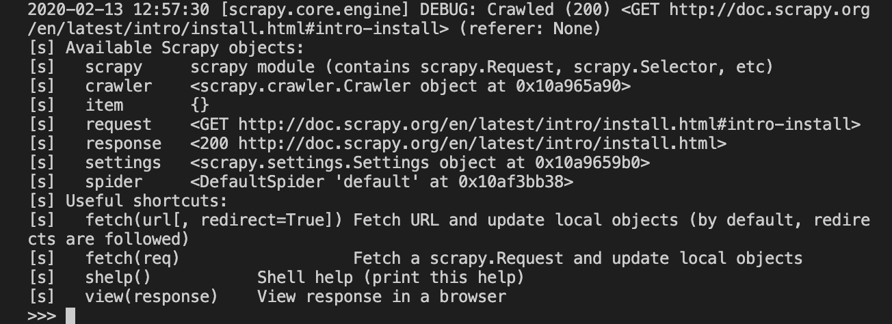

# cs105-prj-phase3-square

## Objective
This is our project on climate change trends. We want to analyze and see if there is a correlation between general weather tends over various areas, and what current meterologists and global warming experts are saying. 

We have included a couple of document and scholarly articles regarding versed meteorologist's findings on the process of climate change and how it has and will affect us if we fail to take action. It was an interesting idea for us to compare articles from 1995 to see what was said about climate change projections by 2020, and more current articles regarding climate change that is projected for the next few decades. We will use Explanatory Data Analysis to compare these static numerical findings to trends we discover in climate data from around the world.

[Here](https://www.un.org/en/sections/issues-depth/climate-change/) is an article from the UN regarding climate change overall, including facts and figures from national conferences and numbers from various countries.

[This scholarly report ](https://books.google.com/books?hl=en&lr=&id=k9n8v_7foQkC&oi=fnd&pg=PP9&dq=climate%20change%20irreversible%20reports&ots=OA_FWynRn-&sig=jtA_u3gmCsmBEJFhxdg9gMM42eo#v=onepage&q=climate%20change%20irreversible%20reports&f=false) provides insight and data from 1995 regarding climate change back then, which we will use to compare with current information and future trends since that year. 

## Phase 1: Data Collection and Data Cleaning 

#### Web-crawler/scraper 
We decided to use Scrapy, a versatile web scraper useful with the framework for Python to help retrieve the data needed. In Scrapy, we built a 'climatebot' spider to crawl information necessary. We used it to get our first dataset (explained in the next paragraph). Scrapy crawled the first page, scraped the link we wanted, then extracted the data in the link from the next page and saved it as a text file to the project folder.

#### Dataset 
The first dataset we want to crawl using Scrapy is the "Climate Change: Earth Surfact Temperature Data" from the years 1750 - 2015. There is more than enough data in this dataset, and includes attributes such as date, average temperature, country, etc. There are multiple .csv files on this page, but we plan to use (at least for now) the Monthly Average Temperature Raw data file.

The second dataset we want to use is the UN article mentioned above,
and we got this simply by going to the website ourselves and will manually input the data for the file and save it into our project folder.

The third dataset is a scholarly google books report where we will read and also extract data manually that we think is significant.

#### How to run the code?
1) Assuming one already has Scrapy installed (if not refer here [Scrapy Installation](http://doc.scrapy.org/en/latest/intro/install.html#intro-install)), create your project with the command " scrapy startproject insertCleverName "

2) In the newly created directory, write your function code for your spider to crawl your dataset (refer to climatebot.py code) and save it under the spiders folder.

3) Now that your spider has been created, you are ready to crawl and retrieve information! Do this with "scrapy crawl [insertNameOfSpider]"

4) There you have it! You have crawled, scraped, and extracted data (depending on your specific spider's code). 

5) To go even further into understanding what is happening, one can use the command "scrapy shell [insertUrlLinkHere]" and test out functions needed for scrapy to use.  If done correctly, it would look something like

## PHASE 2: EDA and Data Cleaning 

#### The Basis for Comparison 
We have combed through the scientific data and predictions we will be comparing our globally collected climate data with. These findings come from government supported reports containing reasonings for certain climate numbers, such as the 1.5 degreed centigrade that we have shown as a majorly significant number. 

A csv file containing the figures we will use as a basis of comparison has been added, and we will use this with future EDA. 

#### Datasets used
Currently we are working with three to four datasets. 
The first dataset is a text file (refer to phase 1 section) which has yet to be analyzed due to errors with the text file when scraping but should be resolved soon.

The second and third datasets (refer to phase 1) have been added as csv files to use for comparison.

The fourth dataset is an extra set we're using to justify our claims. Included is the EDA of it.

### EDA process 

We decided to first clean the data. There were lots of missing values (NaN) since this dataset goes back to around the 1800's for temperature. Since most of the values were around the same, we decided to just fill the NaN values with the mean values.
Next we analyzed the dataset by using a histogram, scatterplots, joint plots, and a boxplot. We did not include a parallel coordinates plane as it wasn't necessary for our data.
More information about the EDA in action can be seen on the "square_proj_phase2.ipynb" file.

#### How to run the code?
1) Assuming that the scraped files and downloaded datasets are already there on top of the Jupyter notebook environment, one can begin to do the EDA by themselves.
2) Once the code has been typed on the Jupyter notebook environment using Python 3 as the kernel, simply click "Restart Kernel and Run all Cells" after clicking on the Kernel tab in Jupyter notebooks.

## Phase 3: Data Analysis Phase

### Datasets used

We decided to just use 1 datset for this. Our fourth one from phase 2 as it is the only one with EDA done on it. We plan on using the dataset to explore two hypothesis in continuing our data analysis. 

Code should be run in the same way as in Phase 2. Reiterated here:
1) Assuming that the scraped files and downloaded datasets are already there on top of the Jupyter notebook environment, one can begin to do the EDA by themselves.
2) Once the code has been typed on the Jupyter notebook environment using Python 3 as the kernel, simply click "Restart Kernel and Run all Cells" after clicking on the Kernel tab in Jupyter notebooks.

### Hypotheses

1) We hypothesize that global warming temperatures increase as the years also increase, and thus have a correlation.

2) We also hypothesize that countries with highly active industrial sectors tend to warm up faster or contribute more to total global warming that their more rural counterparts. 

## Final Thoughts
As we can see, there is an obvious updwards trend in overall temperatures for countries around the world. Our analysis showed that just with 

